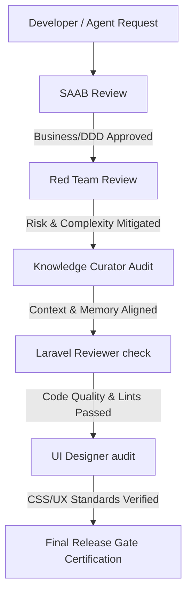

# Enterprise Intelligence Skills (EIS) — Registry

This is the Permanent Registry and dependency map of AI Enterprise Skills for Yalıhan OS.

| Skill | Owner | Version | Status | Dependencies | Core Responsibility |
| :--- | :--- | :---: | :---: | :---: | :--- |
| **saab** | Architecture Office | 1.0 | ✅ Active | - | Architecture validation, DDD bounds, business automation indices. |
| **red-team** | Architecture Office | 1.0 | ✅ Active | saab | Stress tests assumptions, over-engineering checks, risk assessment. |
| **knowledge-curator** | Knowledge Office | 2.0 | ✅ Active | saab | Institutional memory, Living Documents, Graph, Historian. |
| **laravel-reviewer** | Development Office | 1.0 | ✅ Active | saab | PHP/Laravel coding conventions, database queries, N+1 guards. |
| **ui-designer** | Product Office | 1.0 | ✅ Active | saab | CSS token compliance, layout validation, Alpine.js guards. |

---

## EIS Execution Pipeline Runtime Flow

Every developer/agent execution request must pass sequentially through the following pipeline:

