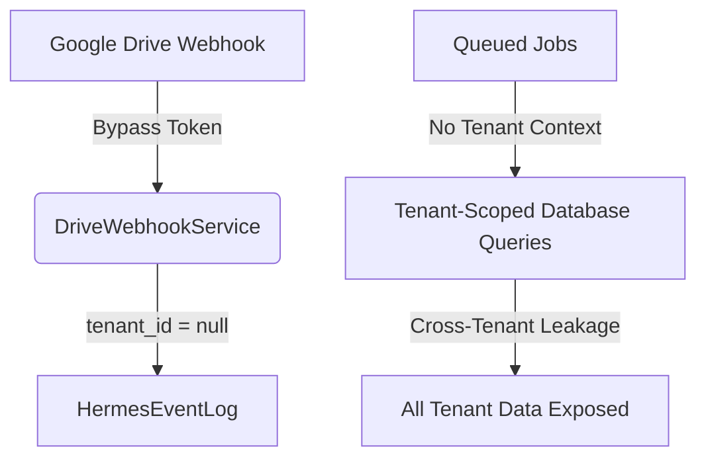

# Yalıhan OS — Security Evidence Audit (Drive & Tenant Isolation)

**Role:** Research Office (Antigravity)  
**Classification:** Restricted / Security Audit Evidence  
**Status:** Completed  
**Date:** 2026-07-07  

---

## 🏛️ Executive Summary
This audit reports critical security vulnerabilities and architectural gaps discovered within the **Google Drive Webhook Integration** and the **Multi-Tenant Job Queue Scoping** of the Yalıhan OS codebase.

Specifically:
1. **Drive Webhook Authentication Bypass:** A logic gap in `DriveWebhookService` allows complete token verification bypass by omitting or sending `null` header values.
2. **Cross-Tenant Event Bleeding:** Lack of `tenant_id` propagation in Drive webhooks causes Hermes event logs to register all actions with `tenant_id = null`, preventing secure isolation audit logs.
3. **Queue Tenant Scoping Orphan State:** Although a Zero-Trust middleware (`RestoreTenantContext`) and interface (`TenantAwareJobInterface`) exist in the codebase, they are **entirely orphan** (not adopted by any job).
4. **Cross-Tenant Data Exposure:** Jobs processing highly sensitive, tenant-scoped models (e.g., `Ilan`, `Kisi`, `Talep`, `FinancialLedger`) execute without setting a tenant context, causing them to either query all tenants' data simultaneously or bleed state between sequential jobs inside the same worker process.

---

## 🔍 Finding List & Detailed Analysis



### 1. DriveWebhookService Token Validation Bypass
* **File Reference:** [`app/Services/Drive/DriveWebhookService.php` L265-272](file:///Users/macbookpro/dev/yalihan2026/app/Services/Drive/DriveWebhookService.php#L265-L272)
* **Risk Severity:** 🔴 **CRITICAL (P0)**
* **Vulnerability Description:**
  The validation logic only checks the channel token if it is provided in the headers. If a client sends a webhook request with a valid `X-Goog-Channel-Id` but completely omits the `X-Goog-Channel-Token` header, the condition `if ($channelToken && $channelToken !== $expectedToken)` evaluates to `false`. The validation successfully passes without asserting token correctness.
* **Reproduction Steps:**
  1. Identify a valid `channel_id` belonging to any portfolio drive workspace.
  2. Send a POST request to `/api/drive/webhook` with the header `X-Goog-Channel-Id: <channel_id>`.
  3. Omit the `X-Goog-Channel-Token` header.
  4. Observe that the service returns `['valid' => true, ...]` and processes the change notification.
* **Recommended Fix Task for VS Code AI:**
  Tighten token validation to ensure the token is both present and matches the expected token:
  ```php
  if (empty($channelToken) || $channelToken !== $expectedToken) {
      Log::warning('[DriveWebhookService] Channel token missing or mismatch', ...);
      return ['valid' => false, 'workspace_id' => null, 'error' => 'Unauthorized'];
  }
  ```

---

### 2. Missing Channel ID Dev Fallback Bypass
* **File Reference:** [`app/Services/Drive/DriveWebhookService.php` L286-288](file:///Users/macbookpro/dev/yalihan2026/app/Services/Drive/DriveWebhookService.php#L286-L288)
* **Risk Severity:** 🟡 **MEDIUM (P2)**
* **Vulnerability Description:**
  If the `X-Goog-Channel-Id` header is completely missing, the method falls back to `['valid' => true, 'workspace_id' => null]`. While intended for development convenience, this fallback is active in production code and allows unauthenticated webhook hits.
* **Recommended Fix Task for VS Code AI:**
  Disable the fallback in non-local environments:
  ```php
  if (!$channelId) {
      if (app()->environment('production', 'staging')) {
          return ['valid' => false, 'workspace_id' => null, 'error' => 'Missing Channel ID'];
      }
      return ['valid' => true, 'workspace_id' => null, 'error' => null];
  }
  ```

---

### 3. Hermes Event Log tenant_id Leakage
* **File References:** 
  * [`DriveWebhookService.php` L393-407](file:///Users/macbookpro/dev/yalihan2026/app/Services/Drive/DriveWebhookService.php#L393-L407) (Payload construction)
  * [`DriveWebhookService.php` L463-470](file:///Users/macbookpro/dev/yalihan2026/app/Services/Drive/DriveWebhookService.php#L463-L470) (Hermes write operation)
* **Risk Severity:** 🟠 **HIGH (P1)**
* **Vulnerability Description:**
  When generating payloads for file changes in `emitDriveEvent()`, the payload array does not contain a `tenant_id` key. When `writeHermesEvent()` attempts to save the log, it executes:
  `$log->tenant_id = $payload['tenant_id'] ?? null;`
  Since the key is missing, all drive webhook logs are written with `tenant_id = null`. This prevents tenant separation in Hermes log audits and allows cross-tenant query contamination.
* **Recommended Fix Task for VS Code AI:**
  Include the workspace tenant ID in the event payload:
  ```php
  $payload = [
      'tenant_id'      => $workspace->tenant_id,
      'workspace_id'   => $workspace->id,
      // ...
  ];
  ```

---

### 4. Zero Adoption of TenantAwareJobInterface & RestoreTenantContext
* **File References:** 
  * [`app/Queue/Middleware/RestoreTenantContext.php`](file:///Users/macbookpro/dev/yalihan2026/app/Queue/Middleware/RestoreTenantContext.php)
  * [`app/Jobs/`](file:///Users/macbookpro/dev/yalihan2026/app/Jobs) (All Job classes)
* **Risk Severity:** 🔴 **CRITICAL (P0)**
* **Vulnerability Description:**
  The project implements a strict `RestoreTenantContext` middleware that asserts `TenantAwareJobInterface` compliance and restores the tenant context before execution to prevent context bleeding. However, **zero jobs** implement this interface or apply the middleware.
  As a result:
  * Background jobs execute without any active tenant context.
  * In the absence of a tenant context, models using `BelongsToTenant` (such as `Ilan`, `Kisi`, `Talep`) bypass the global `TenantScope` query filter and load data across all tenants.
* **Recommended Fix Task for VS Code AI:**
  1. Implement `TenantAwareJobInterface` on all background jobs querying or modifying tenant-scoped database models.
  2. Implement the `middleware()` method in those jobs to return `[new RestoreTenantContext(app(TenantContextService::class))]`.
  3. Ensure jobs accept and serialize the target `tenant_id` in their payload.

---

### 5. Highly Vulnerable Job Implementations

#### Case A: `DailySnapshotsJob.php`
* **File Reference:** [`app/Jobs/AI/DailySnapshotsJob.php` L27](file:///Users/macbookpro/dev/yalihan2026/app/Jobs/AI/DailySnapshotsJob.php#L27)
* **Vulnerability:** Loads `Ilan` records chunk-by-chunk. Since no tenant context is set, it pulls and processes listings across all tenants.
* **Recommended Fix:** Enforce `TenantAwareJobInterface` or execute the snapshot generation partitioned per active tenant.

#### Case B: `OwnerReportExportJob.php`
* **File Reference:** [`app/Jobs/OwnerReport/OwnerReportExportJob.php` L42](file:///Users/macbookpro/dev/yalihan2026/app/Jobs/OwnerReport/OwnerReportExportJob.php#L42)
* **Vulnerability:** Queries `OwnerReportRow::where('owner_id', $this->export->owner_id)`. If two tenants share an owner ID, one tenant can receive the reports and sensitive financial metrics of another tenant.
* **Recommended Fix:** Enforce `TenantAwareJobInterface` and scope the query strictly to the target tenant.

#### Case C: `NotifyN8nAboutIlanPriceChange.php` & `TalepTopluAnalizJob.php`
* **File References:** 
  * [`NotifyN8nAboutIlanPriceChange.php` L89](file:///Users/macbookpro/dev/yalihan2026/app/Jobs/NotifyN8nAboutIlanPriceChange.php#L89)
  * [`TalepTopluAnalizJob.php` L61](file:///Users/macbookpro/dev/yalihan2026/app/Jobs/TalepTopluAnalizJob.php#L61)
* **Vulnerability:** Bypasses tenant scopes when tenant context is null. If context is bled from a previous job, the query fails with a false negative (returning null / not found).
* **Recommended Fix:** Attach `RestoreTenantContext` middleware.
