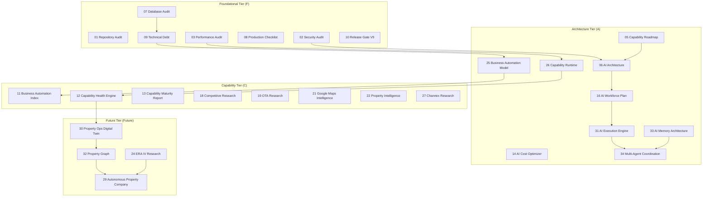

# YALIHAN OS Research Index (`00_RESEARCH_INDEX.md`)

Welcome to the YALIHAN OS Strategic Research Library. This document serves as the Single Source of Truth (SSOT) indexing all research, audits, and capability designs generated by the Antigravity Strategic Research Lab.

---

## 1. Directory Structure & Classification Matrix

All documents are classified into four main tiers:
*   **Foundational (F):** Baseline audits, security gates, and technical debt maps.
*   **Architecture (A):** Structural AI models, orchestration designs, and runtime engines.
*   **Capability (C):** Feature-specific analysis (e.g., Workspace, Publishing, CRM, Reservation).
*   **Future (Future):** ERA IV blueprints for autonomous property operations.

| ID | Title | Tier | Priority | Related Capability | Implementation Status | Related Sprint |
|:---:|:---|:---:|:---:|:---|:---|:---|
| **01** | [01_REPOSITORY_AUDIT.md](file:///Users/macbookpro/dev/yalihan2026/chief-ai/research/01_REPOSITORY_AUDIT.md) | **F** | P0 | System Integrity | ✅ Implemented | PRR Gate |
| **02** | [02_SECURITY_AUDIT.md](file:///Users/macbookpro/dev/yalihan2026/chief-ai/research/02_SECURITY_AUDIT.md) | **F** | P0 | Zero-Trust Security | ✅ Implemented | PRR Gate |
| **03** | [03_PERFORMANCE_AUDIT.md](file:///Users/macbookpro/dev/yalihan2026/chief-ai/research/03_PERFORMANCE_AUDIT.md) | **F** | P1 | Database / Latency | ✅ Implemented | PRR Gate |
| **04** | [04_WORKSPACE_AUDIT.md](file:///Users/macbookpro/dev/yalihan2026/chief-ai/research/04_WORKSPACE_AUDIT.md) | **F** | P0 | Workspace Lifecycle | ✅ Implemented | Sprint 4.6 |
| **05** | [05_CAPABILITY_ROADMAP.md](file:///Users/macbookpro/dev/yalihan2026/chief-ai/research/05_CAPABILITY_ROADMAP.md) | **A** | P0 | Capability Matrix | ✅ Implemented | Sprint 5.0 |
| **06** | [06_AI_ARCHITECTURE.md](file:///Users/macbookpro/dev/yalihan2026/chief-ai/research/06_AI_ARCHITECTURE.md) | **A** | P0 | Cortex Orchestrator | ✅ Implemented | Sprint 5.0 |
| **07** | [07_DATABASE_AUDIT.md](file:///Users/macbookpro/dev/yalihan2026/chief-ai/research/07_DATABASE_AUDIT.md) | **F** | P0 | Schema Integrity | ✅ Implemented | PRR Gate |
| **08** | [08_PRODUCTION_CHECKLIST.md](file:///Users/macbookpro/dev/yalihan2026/chief-ai/research/08_PRODUCTION_CHECKLIST.md) | **F** | P0 | Deployment Gates | ✅ Implemented | PRR Gate |
| **09** | [09_TECHNICAL_DEBT.md](file:///Users/macbookpro/dev/yalihan2026/chief-ai/research/09_TECHNICAL_DEBT.md) | **F** | P1 | Context7 Renaming | 🔄 Active (On-Going) | Sprint 4.9 |
| **10** | [10_RELEASE_GATE_V9.md](file:///Users/macbookpro/dev/yalihan2026/chief-ai/research/10_RELEASE_GATE_V9.md) | **F** | P0 | Release Validation | ✅ Implemented | PRR Gate |
| **11** | [11_BUSINESS_AUTOMATION_INDEX.md](file:///Users/macbookpro/dev/yalihan2026/chief-ai/research/11_BUSINESS_AUTOMATION_INDEX.md) | **C** | P0 | Workspace Telemetry | ✅ Implemented | Sprint 6.1-E07 |
| **12** | [12_CAPABILITY_HEALTH_ENGINE.md](file:///Users/macbookpro/dev/yalihan2026/chief-ai/research/12_CAPABILITY_HEALTH_ENGINE.md) | **C** | P0 | Health Monitoring | ✅ Implemented | Sprint 6.1-E07 |
| **13** | [13_CAPABILITY_MATURITY_REPORT.md](file:///Users/macbookpro/dev/yalihan2026/chief-ai/research/13_CAPABILITY_MATURITY_REPORT.md) | **C** | P1 | Capability Scoring | ✅ Implemented | Sprint 5.1 |
| **14** | [14_AI_COST_OPTIMIZER.md](file:///Users/macbookpro/dev/yalihan2026/chief-ai/research/14_AI_COST_OPTIMIZER.md) | **A** | P1 | Token Optimization | ✅ Implemented | Sprint 5.0 |
| **15** | [15_PRODUCTION_FAILURE_SIMULATION.md](file:///Users/macbookpro/dev/yalihan2026/chief-ai/research/15_PRODUCTION_FAILURE_SIMULATION.md) | **F** | P1 | Fault Tolerance | ✅ Implemented | Sprint 4.7 |
| **16** | [16_AI_WORKFORCE_PLAN.md](file:///Users/macbookpro/dev/yalihan2026/chief-ai/research/16_AI_WORKFORCE_PLAN.md) | **A** | P0 | Agent Topology | ✅ Implemented | Sprint 5.0 |
| **17** | [17_LISTING_STRESS_TEST.md](file:///Users/macbookpro/dev/yalihan2026/chief-ai/research/17_LISTING_STRESS_TEST.md) | **F** | P1 | Load Scaling | ✅ Implemented | Sprint 4.7 |
| **18** | [18_COMPETITIVE_RESEARCH.md](file:///Users/macbookpro/dev/yalihan2026/chief-ai/research/18_COMPETITIVE_RESEARCH.md) | **C** | P1 | Competitor Audits | ✅ Implemented | Sprint 5.2 |
| **19** | [19_OTA_RESEARCH.md](file:///Users/macbookpro/dev/yalihan2026/chief-ai/research/19_OTA_RESEARCH.md) | **C** | P0 | Channel Manager | ✅ Implemented | Sprint 5.2 |
| **20** | [20_AIRBNB_SUPERHOST_AUTOMATION.md](file:///Users/macbookpro/dev/yalihan2026/chief-ai/research/20_AIRBNB_SUPERHOST_AUTOMATION.md) | **C** | P1 | Airbnb Integration | ✅ Implemented | Sprint 5.2 |
| **21** | [21_GOOGLE_MAPS_INTELLIGENCE.md](file:///Users/macbookpro/dev/yalihan2026/chief-ai/research/21_GOOGLE_MAPS_INTELLIGENCE.md) | **C** | P0 | Location Matching | ✅ Implemented | Sprint 5.1 |
| **22** | [22_PROPERTY_INTELLIGENCE.md](file:///Users/macbookpro/dev/yalihan2026/chief-ai/research/22_PROPERTY_INTELLIGENCE.md) | **C** | P0 | Market Valuation | ✅ Implemented | Sprint 5.1 |
| **23** | [23_SELF_HEALING_PLATFORM.md](file:///Users/macbookpro/dev/yalihan2026/chief-ai/research/23_SELF_HEALING_PLATFORM.md) | **A** | P1 | Auto-Recovery | ✅ Implemented | Sprint 4.7 |
| **24** | [24_ERA_IV_RESEARCH.md](file:///Users/macbookpro/dev/yalihan2026/chief-ai/research/24_ERA_IV_RESEARCH.md) | **Future** | P0 | Vision Strategy | 🔵 Research (Planned) | Sprint 7.0 |
| **25** | [25_BUSINESS_AUTOMATION_MODEL.md](file:///Users/macbookpro/dev/yalihan2026/chief-ai/research/25_BUSINESS_AUTOMATION_MODEL.md) | **A** | P0 | Telemetry Model | ✅ Implemented | Sprint 6.1-E07 |
| **26** | [26_CAPABILITY_RUNTIME.md](file:///Users/macbookpro/dev/yalihan2026/chief-ai/research/26_CAPABILITY_RUNTIME.md) | **A** | P0 | Runtime Health State | ✅ Implemented | Sprint 6.1-E07 |
| **27** | [27_CHANNEX_RESEARCH.md](file:///Users/macbookpro/dev/yalihan2026/chief-ai/research/27_CHANNEX_RESEARCH.md) | **C** | P0 | Channex Integration | ✅ Implemented | Sprint 5.2 |
| **28** | [28_AI_COST_TELEMETRY.md](file:///Users/macbookpro/dev/yalihan2026/chief-ai/research/28_AI_COST_TELEMETRY.md) | **A** | P1 | Token Telemetry | ✅ Implemented | Sprint 5.0 |
| **29** | [29_AUTONOMOUS_PROPERTY_COMPANY.md](file:///Users/macbookpro/dev/yalihan2026/chief-ai/research/29_AUTONOMOUS_PROPERTY_COMPANY.md) | **Future** | P0 | Strategy Roadmap | 🔵 Research (Planned) | Sprint 7.0 |
| **30** | [30_PROPERTY_OPERATIONS_DIGITAL_TWIN.md](file:///Users/macbookpro/dev/yalihan2026/chief-ai/research/30_PROPERTY_OPERATIONS_DIGITAL_TWIN.md) | **Future** | P0 | Living Twin / IoT | 🔵 Research (Planned) | Sprint 6.2 |
| **31** | [31_AI_EXECUTION_ENGINE.md](file:///Users/macbookpro/dev/yalihan2026/chief-ai/research/31_AI_EXECUTION_ENGINE.md) | **A** | P0 | Hermes Execution | 🔵 Research (Planned) | Sprint 6.3 |
| **32** | [32_PROPERTY_GRAPH.md](file:///Users/macbookpro/dev/yalihan2026/chief-ai/research/32_PROPERTY_GRAPH.md) | **Future** | P0 | Graph Context | 🔵 Research (Planned) | Sprint 6.4 |
| **33** | [33_AI_MEMORY_ARCHITECTURE.md](file:///Users/macbookpro/dev/yalihan2026/chief-ai/research/33_AI_MEMORY_ARCHITECTURE.md) | **A** | P1 | Multi-Tier Memory | 🔵 Research (Planned) | Sprint 6.5 |
| **34** | [34_MULTI_AGENT_COORDINATION.md](file:///Users/macbookpro/dev/yalihan2026/chief-ai/research/34_MULTI_AGENT_COORDINATION.md) | **A** | P1 | Multi-Agent Locks | 🔵 Research (Planned) | Sprint 6.6 |
| **35** | [35_WIZARD_BLOCKERS.md](file:///Users/macbookpro/dev/yalihan2026/chief-ai/research/35_WIZARD_BLOCKERS.md) | **F** | P0 | Listing Wizard / CRM | 🔵 Research (Planned) | Sprint 6.2 |
| **36** | [29_ENTERPRISE_INTELLIGENCE_SKILLS.md](file:///Users/macbookpro/dev/yalihan2026/chief-ai/research/29_ENTERPRISE_INTELLIGENCE_SKILLS.md) | **A** | P0 | EIS Strategy Blueprint | ✅ Implemented | Sprint 7.0 |

---

## 2. Independent Audits & Special Reports

These unnumbered specialized research documents compile evidence and verification reports on specific repository-wide requirements:
*   [AGGREGATE_INTEGRITY_REPORT.md](file:///Users/macbookpro/dev/yalihan2026/chief-ai/research/AGGREGATE_INTEGRITY_REPORT.md): Deep-dive audit verifying `PropertyWorkspace` state consistency and replay safety.
*   [AUTHORIZATION_TENANT_SECURITY_AUDIT.md](file:///Users/macbookpro/dev/yalihan2026/chief-ai/research/AUTHORIZATION_TENANT_SECURITY_AUDIT.md): Security analysis of tenant scopes, global scopes, and role-based actions.
*   [BUSINESS_AUTOMATION_AUDIT.md](file:///Users/macbookpro/dev/yalihan2026/chief-ai/research/BUSINESS_AUTOMATION_AUDIT.md): High-level operational analysis of human workload patterns.
*   [CAPABILITY_BOUNDARY_MATRIX.md](file:///Users/macbookpro/dev/yalihan2026/chief-ai/research/CAPABILITY_BOUNDARY_MATRIX.md): Detailed matrix defining boundaries between different sub-services.
*   [RELEASE_READINESS_INDEPENDENT_AUDIT.md](file:///Users/macbookpro/dev/yalihan2026/chief-ai/research/RELEASE_READINESS_INDEPENDENT_AUDIT.md): Complete PRR audit summarizing database, security, and performance test findings.
*   [SECURITY_HARDENING_VERIFICATION_R11_R15.md](file:///Users/macbookpro/dev/yalihan2026/chief-ai/research/SECURITY_HARDENING_VERIFICATION_R11_R15.md): Zero-Trust validation report for Drive webhooks and multi-tenant queue middleware.
*   [TECHNICAL_DEBT_MAP.md](file:///Users/macbookpro/dev/yalihan2026/chief-ai/research/TECHNICAL_DEBT_MAP.md): Heatmap mapping legacy columns and planned Context7 renames.

---

## 3. Dependency Graph

