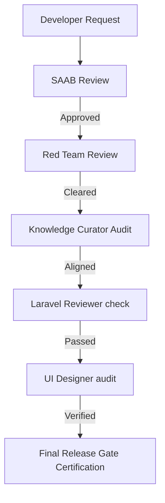

# Strategic Architecture Blueprint: Enterprise Intelligence Skills (EIS)

**Document Reference:** EIS-2026-07-14  
**Title:** "Teach AI how your organization thinks—not just how it codes."  
**Status:** 🔵 Research (Draft)  
**Author:** Strategic AI Architecture Board (SAAB) v9  

---

## 1. Executive Summary

As AI-driven software development progresses, the bottleneck shifts from writing lines of code to maintaining architectural integrity, validating business value, and retaining organizational memory.

**Enterprise Intelligence Skills (EIS)** is a governance platform designed to bridge the gap between human architectural decisions and autonomous agent behaviors. Rather than treating AI agents as simple coding completion loops, EIS equips them with executable organizational knowledge, business validation standards, and guard rails.

---

## 2. Platform Architecture

The EIS platform operates on a sequential execution pipeline where every proposed change is reviewed for business value, risk, documentation alignment, and code standard compliance.



### Core Skill Hierarchy

1.  **🥇 Knowledge Curator (v2.0):** The Repository Intelligence Engine. Tracks the repository knowledge graph, flags duplicate documents, analyzes reference integrity, and acts as the Historian.
2.  **🥈 SAAB:** Enforces Bounded Contexts, CQRS boundaries, and calculates the Business Automation Index (BAI).
3.  **🥉 Red Team:** Attacks architectural complexity, flags over-engineering, and runs fail-scenario audits.
4.  **4️⃣ Laravel Reviewer:** Assesses technology alignment, N+1 query patterns, and Laravel-specific anti-patterns.
5.  **5️⃣ UI Designer:** Audits Mediterranean Design System variables, icon component compliance, and Alpine.js runtime rules.

---

## 3. Knowledge Curator Deep-Dive

The Knowledge Curator is the curator of institutional memory. It handles the following automation commands:

### Command Specifications

#### `knowledge:audit`
Scans all workspace files to compute a composite **Knowledge Health Score**.
*   **Metric Formulation:**
    $$\text{Knowledge Health} = \frac{\text{Canonical Docs} - (\text{Duplicates} + \text{Broken Refs} + \text{Drifts})}{\text{Total Docs}}$$
*   **Output Mockup:**
    ```text
    Repository Health:  97.4% [HEALTHY]
    Knowledge Score:    98.1%
    Canonical Docs:     42
    Duplicate Docs:     3
    Broken References:  1
    Archive Candidates: 17
    Living Documents:   28
    Outdated Documents: 6
    ```

#### `knowledge:history <concept>`
Traces any architectural concept or decision to its historical origins in the codebase and Git history.
*   **Trace Flow:**
    ```text
    Research Proposal (chief-ai/research/04_WORKSPACE_AUDIT.md)
       └─ Board Resolution (BR-2026-07-05-WORKSPACE-SEAL)
            └─ ADR Entry (docs/adr/042-workspace-state-isolation.md)
                 └─ Sprint Charter (Sprint 6.0 Charter)
                      └─ Commits (app/Services/Workspace/*)
                           └─ Test Verification (Tests/Feature/WorkspaceTest.php)
                                └─ Production Release Certification
    ```

#### `knowledge:drift`
Performs continuous integration checks between active implementation blueprints and the actual repository state. Identifies when code shifts away from the agreed-upon ADR contracts.

---

## 4. Next Steps & Handoff

This blueprint will be handed off to the Engineering Office (Kilo) to build the CLI executor (`php artisan knowledge:audit`, etc.) and the automated runtime pipeline inside Yalıhan OS.
