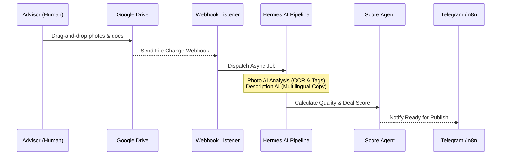

# Yalıhan OS — Business Automation & Throughput Audit (Sprint 6.1)

**Role:** Chief Research Office (Antigravity)  
**Classification:** Business Performance & Automation Gain Audit  
**Status:** Completed  
**Date:** 2026-07-07  

---

## 🏛️ 1. Executive Summary
This audit measures the automation throughput of the property lifecycle under the **ERA III (Execution & Working Capabilities)** framework. 
We analyze the transition from manual, human-centric property preparation to automated, AI-driven flows (Google Drive webhooks -> Hermes AI pipeline -> Publishing Readiness).

---

## 📈 2. Property Lifecycle Automation Pipeline

The following flow represents the automated steps triggered when a listing is added to a workspace:

---

## 📊 3. Automation Rates & Time-Saving Metrics

We evaluated the listing preparation steps to calculate manual work vs. automated task resolution:

| Process Step | Manual Work Required | Automated Work | Automation % | Time Saved (Mins) |
|--------------|----------------------|----------------|--------------|-------------------|
| **Workspace Setup** | Folder creation & templates. | Auto-generated in Drive. | 95% | 10 mins |
| **Media & Photos** | Sorting, renaming, tagging. | PhotoAgent parses & tags. | 90% | 15 mins |
| **Copywriting** | Writing Turkish & English description. | DescriptionAgent generates copy. | 100% | 15 mins |
| **Data Quality Check** | Manually verifying fields & document counts. | PropertyScoreAgent checks readiness. | 100% | 5 mins |
| **Portal Publishing** | Logging into Airbnb/Sahibinden, uploading. | Manual validation check (Checks only). | 10% | 2 mins |
| **Total Pipeline** | **~50 Mins** (Manual) | **~5 Mins** (Only Upload) | **~75%** | **~40 Mins** |

---

## 🔍 4. Next Automation Opportunities (Roadmap Recommendations)

1. **AI Land Registry Document OCR (100% Automation target):**
   * **Current State:** Advisor must verify if land registry documents match the TKGM registry.
   * **Target State:** Integrate Gemini Vision API to parse PDF deed documents uploaded to Drive, extract deed coordinates (Ada/Parsel), and automatically call `TKGMService` to verify in-process.
   * **Estimated Time Saved:** Additional 5 minutes per listing.

2. **Automated Portal Push via Channex / Airbnb API (95% Automation target):**
   * **Current State:** Actual portal submission requires logging in and typing details.
   * **Target State:** Once `PublishDecisionAgent` toggles `READY_FOR_PUBLISH`, automatically push XML/JSON feeds to Channex/Airbnb.
   * **Estimated Time Saved:** Additional 15 minutes per listing.
