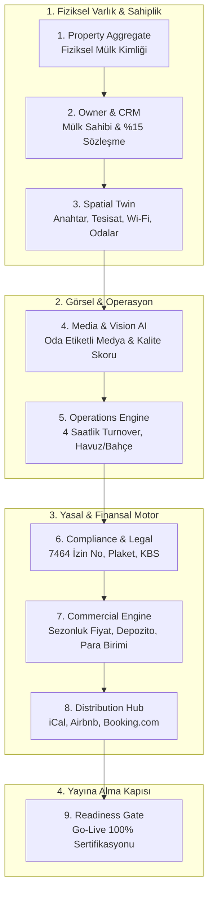

# YALIHAN OS — PROPERTY ONBOARDING 2.0 & DIGITAL TWIN BUILDER
## Enterprise Architecture & Product Discovery Report

**Doküman Kodu:** `DISCOVERY-ONBOARDING-2.0`  
**Tarih:** 2026-08-23  
**Otorite:** SAAB / Release Authority  
**Araştırmacı Ajan:** Antigravity (Gemini 3 Pro)  
**Kapsam:** Mevcut Wizard 1.0 Analizi & Hedef 2.0 Dijital İkiz Mimarisi  
**Pilot Referansı:** PILOT-01 (Villa Betül)  

---

## 1. YÖNETİCİ ÖZETİ VE STRATEJİK HEDEF

Yalıhan OS, geleneksel bir *"emlak ilan sitesi"* değil; Bodrum merkezli lüks gayrimenkul ve kısa dönemli operasyonları yöneten otonom bir **Gayrimenkul İşletim Sistemi (Property OS)**'dir.

Mevcut Wizard 1.0 (`/admin/ilanlar/create-wizard`), gayrimenkulü yalnızca bir web sayfası ilanı (pazarlama verisi) olarak ele almakta; mülkün **fiziksel, operasyonel, yasal ve ticari gerçekliğini** dışarıda bırakmaktadır.

### Temel Yönetişim Sorusu:
> *"Ayhan olmadan, başka bir Yalıhan operasyon personeli sisteme bakarak Villa Betül'ü yarın sabah sıfır telefon trafiğiyle yönetebilir, misafiri karşılayabilir, temizliği koordine edebilir ve mal sahibine hak edişini ödeyebilir mi?"*

Bu rapor, **Wizard 1.0'ın sınırlarını** ortaya koymakta ve **Property Onboarding 2.0 (Digital Twin Builder)** için 9 sütunlu hedef mimariyi tanımlamaktadır.

```
┌────────────────────────────────────────────────────────────────────────────────────────┐
│                   PROPERTY ONBOARDING 2.0 CANONICAL PIPELINE                           │
│                                                                                        │
│  [1. Property] ──► [2. Owner] ──► [3. Spatial Twin] ──► [4. Media] ──► [5. Operations] │
│         │                                                                     │        │
│         └────────► [6. Compliance] ──► [7. Commercial] ──► [8. Distribution] ─┴───────►│
│                                                                                        │
│                              └──► [9. READINESS GATE (Go-Live)]                        │
└────────────────────────────────────────────────────────────────────────────────────────┘
```

---

## 2. MEVCUT WIZARD 1.0 ANALİZİ & GERÇEK OPERASYONEL SÜRTÜNMELER

Mevcut kod tabanında (`IlanCrudController`, `StoreIlanRequest`, `EffectiveWizardSchemaResolver`, `resources/views/admin/ilanlar/wizard/*`) yapılan mimari denetimde tespit edilen temel aksaklıklar:

### 2.1. Kullanıcı Arayüzü & Akış Sürtünmeleri (UI/UX Friction)
1. **Zamansız Validasyon Uyarıları (Premature Validation):**
   - *Hata:* Kullanıcı henüz Adım 1'de kategori seçerken JavaScript katmanı *"İlan başlığı girmelisiniz"* uyarısı fırlatarak akışı kesmektedir.
   - *Kök Neden:* `step1-cascade.js` ve Alpine.js `listing` store'u arasındaki senkronizasyon eksikliği.
2. **Kategori-Yayın Tipi Kilitlenmesi (Junction Lock):**
   - *Hata:* `alt_kategori_yayin_tipi` tablosunda pivot kayıt eksik olduğunda veya `EffectiveListingTypeResolver` eşleşme bulamadığında, yayın tipi dropdown'ı kilitlenmekte ve form ilerletilememektedir.
3. **Oda Sayısı Katılığı (Strict Integer Type):**
   - *Hata:* Bodrum/Türkiye pazarında standart olan `'4+1'`, `'3+2'`, `'Dublex 5+1'` gibi ifadeler `StoreIlanRequest` içinde `integer` kuralına takılmakta ve formu reddetmektedir.

---

## 3. PROPERTY ONBOARDING 2.0: 9 SÜTUNLU HEDEF MİMARİ



---

### SÜTUN 1: PROPERTY AGGREGATE & ASSET IDENTITY (Mülk Kimliği)
- **Mevcut Durum:** `Ilan` modeli hem pazarlama ilanını hem fiziksel mülkü tek tabloda (`ilanlar`) tutuyor.
- **2.0 Hedefi:**
  - `Property` (Fiziksel Varlık): Adres, ada/parsel, fiziksel sınırlar, yapı kayıt, m2.
  - `Listing` (Pazarlama İlanı): Başlık, açıklama, portal senkronizasyonu, öne çıkarma.
  - *İş Değeri:* Bir villanın hem uzun dönem kiralık, hem sezonluk, hem satılık olarak farklı başlıklarla pazarlanabilmesi; ancak fiziksel operasyonunun tek bir dijital ikiz üzerinden yürümesi.

---

### SÜTUN 2: OWNER & COMMERCIAL RELATIONSHIP (Mülk Sahibi & CRM)
- **Mevcut Durum:** `ilanlar.ilan_sahibi_id` $\rightarrow$ `kisiler.id` bağlantısı mevcut. `ManagementModel` enum'ı (`FULL_MANAGEMENT` %15) var.
- **2.0 Hedefi:**
  - **Mal Sahibi IBAN & Fatura Bilgileri:** Hakediş ödemelerinin (`Owner Payable`) yapılacağı banka hesabı doğrudan onboarding sırasında zorunlu tutulmalı.
  - **Sözleşme Eki:** Yalıhan ile mal sahibi arasındaki yönetim yetki sözleşmesi PDF olarak mülkün Drive alanına (`PortfolioDriveWorkspace`) otomatik arşivlenmeli.
  - **Mal Sahibi Blokajı (Blackout Dates):** Mal sahibinin villayı kendisinin kullanacağı tarihlerin takvimde sıfır bedelle kilitlenmesi.

---

### SÜTUN 3: SPATIAL TWIN (Fiziksel & Mekânsal Dijital İkiz)
- **Mevcut Durum:** Sadece enlem, boylam, adres metni ve toplam oda/banyo sayısı var.
- **2.0 Hedefi (Bodrum Operasyon Gerçekliği):**
  - **Giriş / Anahtar Mimarisi:** Akıllı kilit kodu, Keybox şifresi veya Meet & Greet karşılama notu.
  - **Kritik Tesisat Noktaları:**
    - Su deposu & hidrofor şalteri konumu (Bodrum su kesintileri yönetimi).
    - Ana elektrik panosu / sigorta kutusu konumu.
    - İnternet modemi konumu, Wi-Fi ağ adı ve şifresi.
  - **Oda & Yatak Dağılımı (Room Matrix):**
    - Yatak Odası 1: Master, King Yatak, Ebeveyn Banyosu, Jakuzi.
    - Yatak Odası 2: 2 Tek Kişilik Yatak.
    - Salon: Açılır Kanepe.

---

### SÜTUN 4: MEDIA & CORTEX VISION INTELLIGENCE (Medya & Görsel Zeka)
- **Mevcut Durum:** `IlanPhotoService` ile `public` diske yükleme var. Cortex AI kalite widget'ı mevcut.
- **2.0 Hedefi:**
  - **Oda Bazlı Medya Etiketleme:** Yüklenen fotoğrafların "Salon", "Havuz", "Ana Yatak Odası", "Mutfak" olarak sınıflandırılması.
  - **Kapak Resmi Algoritması:** Cortex Vision'ın en yüksek çözünürlüklü ve estetik havuz/dış cephe fotoğrafını otomatik kapak resmi önermesi.
  - **Kat Planı & Sanal Tur:** 2D/3D kat planı ve 360 sanal tur linklerinin bağlanması.

---

### SÜTUN 5: OPERATIONS & TURNOVER ARCHITECTURE (Operasyon & Temizlik)
- **Mevcut Durum:** `PropertyReadiness` modeli var; ancak rezervasyona bağlı çalışıyor, onboarding sırasında parametreleri tanımlanmıyor.
- **2.0 Hedefi:**
  - **4 Saatlik Turnover Penceresi:** Standart Çıkış Saati (11:00) ve Giriş Saati (15:00) tanımları.
  - **Periyodik Hizmet Takvimi:**
    - Havuz Bakımı: Salı & Cuma 07:00.
    - Bahçıvan: Çarşamba 09:00.
  - **Varsayılan Operasyon Görevlisi:** Villadan sorumlu temizlik personeli ve karşılama sorumlusu ataması.

---

### SÜTUN 6: COMPLIANCE & LEGAL (7464 Sayılı Kanun & KBS)
- **Mevcut Durum:** Türkiye mevzuatına özel alanlar eksik.
- **2.0 Hedefi:**
  - **Turizm Konutu İzin Belge No:** Kültür ve Turizm Bakanlığı izin belge numarası.
  - **Kapı Plaket Numarası:** Kapıya asılan resmi plaket seri no.
  - **KBS Tesis Kodu:** Jandarma/Polis Kimlik Bildirim Sistemi tesis eşleşme kodu.
  - **Mal Sahibi Vergi / TCKN:** Stopaj ve faturalandırma için kimlik doğrulama.

---

### SÜTUN 7: COMMERCIAL ENGINE (Fiyatlandırma, Sezonlar & Depozito)
- **Mevcut Durum:** Taban fiyat (`fiyat`), para birimi (`para_birimi`) ve `PropertySeasonalRate` tablosu var.
- **2.0 Hedefi:**
  - **Hasar Depozitosu Politikası:** Tutar (ör. 10.000 TL), tahsilat şekli (Girişte Nakit / Kredi Kartı Bloke / Havale) ve iade protokolü.
  - **Sezonluk Fiyat Matrisi:** Düşük (Mayıs/Ekim), Orta (Haziran/Eylül), Yüksek (Temmuz/Ağustos) sezon taban fiyatları ve minimum gece kuralları.
  - **Temizlik & Ek Hizmet Bedelleri:** Kısa konaklama temizlik ücreti tanımı.

---

### SÜTUN 8: DISTRIBUTION HUB (Kanal & Takvim Senkronizasyonu)
- **Mevcut Durum:** `IlanTakvimSync` (iCal), Booking.com Channel Manager altyapısı mevcut.
- **2.0 Hedefi:**
  - Onboarding sırasında mülkün varsa dış iCal linklerinin (Airbnb iCal, Google Takvim) doğrudan girilmesi.
  - Mülk kaydedildiği anda dış kanallardan rezervasyonları çekip takvimi anında senkronize etmesi.

---

### SÜTUN 9: READINESS GATE (Go-Live Sertifikasyon Kapısı)
- **Mevcut Durum:** Form doldurulup kaydedildiğinde doğrudan `yayinda` veya `taslak` oluyor; eksik veri denetimi zayıf.
- **2.0 Hedefi:**
  - İlanın `YAYINDA` (Active) durumuna geçebilmesi için otomatik **100 Puanlık Readiness Skoru**:
    - [x] En az 5 yüksek çözünürlüklü fotoğraf yüklendi mi?
    - [x] Mülk sahibi ve IBAN doğrulandı mı?
    - [x] Giriş şifresi / Wi-Fi bilgisi girildi mi?
    - [x] Turizm izin belgesi veya muafiyet beyanı var mı?
    - [x] Taban fiyat ve sezonluk fiyatlar tanımlandı mı?
    - [x] Temizlik sorumlusu belirlendi mi?
  - Skor < %80 ise sistem mülkü yalnızca `TASLAK (DRAFT)` olarak tutar, eksik listesini gösterir.

---

## 4. EYLEM PLANI & GÖREV DAĞILIMI

Bu keşif raporu doğrultusunda iş iki paralel hatta ayrılır:

### Hat A: Mevcut Wizard 1.0 için Acil P0/P1 Düzeltmeleri (Claude Sonnet 4.6 Görevi)
Ayhan'ın Villa Betül'ü mevcut arayüzden kesintisiz girebilmesi için hemen yapılacak cerrahi düzeltmeler:
1. **P0:** Kategori adımında çıkan zamansız *"İlan başlığı girmelisiniz"* JS validation popup'ını kaldır / adımlara göre izole et.
2. **P1:** `StoreIlanRequest` içinde `oda_sayisi` alanını esnet (string ve '4+1' formatına izin ver veya sanitize et).
3. **P1:** `EffectiveListingTypeResolver` fallback mekanizmasını güçlendir; pivot tablosu boş olsa dahi varsayılan yayın tiplerini güvenle döndür.
4. **P1:** Hetzner production Nginx konfigürasyonundaki `location /storage/ { internal; }` kısıtlamasını `storage:link` uyumlu hale getir.

### Hat B: Property Onboarding 2.0 Mimari Geliştirmesi (Gelecek Sprintler)
- 9 sütunlu mimarinin adım adım `app/Domains/Property/` ve modern Alpine/Blade arayüzüyle inşa edilmesi.

---
*SAAB Kararı: Hat A hotfixleri onaylanıp Kilo Code'a verilebilir; Ayhan Villa Betül pilotuna devam eder.*
