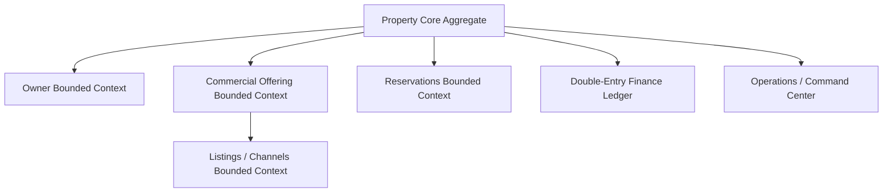

# SAAB Board Resolution — BR-20260724-DIGITAL-PROPERTY-OS
**Strategic Architecture & Automation Board (SAAB)**  
**Date:** 2026-07-24T17:56:55+03:00  
**Status:** RATIFIED & APPROVED  

---

## 1. Bounded Context & Platform Definition
The board officially ratifies the transition of Yalıhan OS from an "agency CRM" model to a **Digital Property Operating System (DPOS)**. This unified system consolidates physical real estate assets, commercial listings, financial ledgers, guest reservations, and automated workforce operations around a single central core.

---

## 2. Approved Strategic Components

The following key architectural and product boundaries have been formally approved:

| Capability / Component | SAAB Decision | Implementation Phase |
|---|---|---|
| **Property Canonical Model** | `✅ APPROVED` | Core Foundation (Active) |
| **Commercial Offering Layer** | `✅ APPROVED` | Core Foundation (Sprint 18) |
| **Property Command Center** | `✅ APPROVED` | Operations (Sprint 19) |
| **Canonical Reservation Flow** | `✅ APPROVED` | Operations |
| **Channel Manager Roadmap** | `✅ APPROVED` | Operations |
| **Company Brain Vision** | `✅ APPROVED` | Intelligence (Long-term) |
| **Global Country Engine** | `✅ APPROVED` | Infrastructure |
| **Partner Network** | `✅ APPROVED` | Future Phase |
| **Omnichannel Communication** | `✅ APPROVED` | Operations |

---

## 3. Three-Tier Product Strategy

To guide engineering and AI-agent implementation priorities, the platform is divided into three distinct layers:

### A. Foundation Layer (Core Data Assets)
*   **Scope:** Property, Owner, Reservation, Finance, Documents.
*   **Goal:** Establish immutable, tenant-isolated data aggregates.

### B. Operations Layer (Publishing & Workflows)
*   **Scope:** Channel Manager, Action Center, Command Center, Omnichannel, Publishing.
*   **Goal:** Automate publishing, guest comms, and sync.

### C. Intelligence Layer (AI & Twins)
*   **Scope:** Company Brain, Ask YALIHAN, Decision Intelligence, Property Digital Twin, Predictive AI.
*   **Goal:** Contextual decision-making and autonomous execution.

---

## 4. SAAB Governance Invariants & Warning Directives

### Directives for AI Agents & Developers:
1.  **Discipline of Implementation:** Conceptual velocity must not outpace implementation velocity. Focus must shift from defining new designs to implementing working capabilities in production PHP code.
2.  **The BAI Filter:** Scope creep is strictly regulated. Every proposed capability must answer the core question: *Does this feature directly increase the Business Automation Index (BAI)?* If not, it must be pushed to the backlog.
3.  **Core Success Metric:** The platform's success is measured by the metric: *Can the manager complete 90% of mülk operations directly from a single Property Cockpit screen?*

---

## 5. Normalized Implementation Sequence

All subsequent development sprints must adhere to the following sequence:

1.  **Repository Audit & Baseline** (Completed)
2.  **Property Classification** (Active)
3.  **Property Aggregate** (Sprint 17)
4.  **Commercial Offering** (Sprint 18)
5.  **Canonical Reservation**
6.  **Availability Engine**
7.  **Channel Manager**
8.  **Property Command Center**
9.  **Action Center**
10. **Ask YALIHAN**
