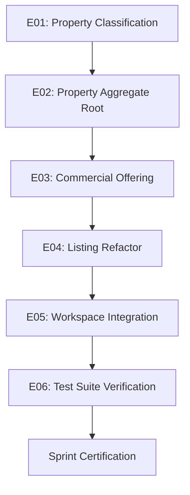

# SAAB Board Resolution — BR-20260724-IMPLEMENTATION-TRANSITION
**Strategic Architecture & Automation Board (SAAB)**  
**Date:** 2026-07-24T18:37:17+03:00  
**Status:** RATIFIED & APPROVED  

---

## 1. Executive Summary & Mode Shift

The Strategic Architecture & Automation Board (SAAB) formally closes the Architectural Discovery & Governance Synthesis Phase (Phase 1 to Phase 3B). 

The platform identity is ratifying the transition:
*   **From:** "AI-assisted real estate CRM"
*   **To:** **Digital Property Operating System (DPOS)**

The repository governance, institutional memory, evidence registries, and baseline metrics have been established and committed. The engineering teams are instructed to **exit vision/documentation mode** and **enter evidence-producing implementation mode**.

---

## 2. Immutable Architecture Backbone

All future development must adhere to the single canonical aggregate dependency chain:

```
Property (Physical Asset)
   │
   ▼
Commercial Offering (Pricing & Terms)
   │
   ▼
Listing (Publication Representation)
   │
   ▼
Reservation (Booking Contract)
   │
   ▼
Finance (Double-Entry Ledger)
   │
   ▼
Operations (Turnover & Handovers)
```

---

## 3. The 3 Sprint Verification Questions

At the end of every implementation sprint, the completed work must satisfy and affirmatively answer the following three questions:

1.  **Capability Addition:** *Did this sprint add a working, verifiable new capability in production PHP code?*
2.  **Automation Score:** *Did it measurably increase the Business Automation Index (BAI)?*
3.  **Manual Work Reduction:** *Did it concretely reduce manual work duration or frequency for real estate advisors and property managers?*

---

## 4. Sprint 17B Implementation Sequence

The next implementation program follows the strict dependency order:



### Subsequent Program (Reservation-to-Operations Loop):
$$\text{Reservation Core} \longrightarrow \text{Availability} \longrightarrow \text{Conflict Detection} \longrightarrow \text{Execution Audit} \longrightarrow \text{Timeline} \longrightarrow \text{Channel Adapters}$$
