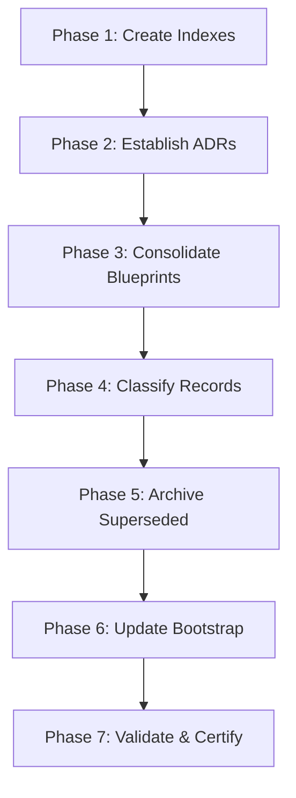

# Repository Memory Discovery Report: Yalıhan AI OS
**Sponsor:** Strategic Architecture & Automation Board (SAAB)  
**Author:** Antigravity Research Office (Kilo Agent)  
**Status:** PROPOSED (Awaiting SAAB Approval)  
**Date:** 2026-07-24  
**Ratified Charter:** SAAB v11.1 (Governance Frozen)  

---

## 1. Executive Summary

Yalıhan AI OS has evolved through multiple development Eras:
*   **Era I:** Architectural Design
*   **Era II:** Infrastructure & AST Guardians (`Bekci`, `sab:integrity-scan`)
*   **Era III:** Observation, Execution, and Integration Layer Segmentation (Sprint 4.6–4.8)
*   **Era IV (Active):** Productization & Autonomous Operations (Sprint 10–12E, Milestone M2 Certified)

While technical execution has been highly disciplined, the documentation of this evolution has fragmented across multiple competing directories (`/`, `docs/`, `memory/`, `.sab/`, `.agents/`, `chief-ai/`). This fragmentation introduces cognitive friction for human developers and AI agents, causing link rot, duplicates, and outdated policy statements.

This discovery report initiates **Sprint 0: Repository Knowledge Recovery**. Our mission is to analyze the complete repository, establish a Single Source of Truth (SSOT) architecture, and plan a non-destructive migration to a consolidated **Institutional Memory System**. 

> [!IMPORTANT]
> **Safety Guarantee:** No production code will be modified, no files renamed/deleted, and no migrations created in this phase. This report is strictly analytical and advisory.

---

## 2. Current Documentation Inventory

We have discovered **6 distinct documentation silos** across the repository.

### A. Root Directory (`/`)
*   [README.md](file:///Users/macbookpro/dev/yalihan2026/README.md): High-level system overview.
*   [ROADMAP.md](file:///Users/macbookpro/dev/yalihan2026/ROADMAP.md): **Obsolete Version 1.1** (Last updated 2026-07-03, Sprint 4.1).
*   [START_HERE.md](file:///Users/macbookpro/dev/yalihan2026/START_HERE.md): Onboarding primer.
*   [STATE_PACKET.md](file:///Users/macbookpro/dev/yalihan2026/STATE_PACKET.md): System state capture.
*   [SECURITY_EVIDENCE_DRIVE_TENANT_AUDIT.md](file:///Users/macbookpro/dev/yalihan2026/SECURITY_EVIDENCE_DRIVE_TENANT_AUDIT.md): Special security proof.

### B. Global Customizations / Agent Root (`.agents/`)
*   [AGENTS.md](file:///Users/macbookpro/dev/yalihan2026/.agents/AGENTS.md): Core agent rules and bootstrap contract.
*   [CORE-CONSTITUTION.md](file:///Users/macbookpro/dev/yalihan2026/.agents/CORE-CONSTITUTION.md): Baseline developer rules.
*   [EIOS-BOOTSTRAP.md](file:///Users/macbookpro/dev/yalihan2026/.agents/EIOS-BOOTSTRAP.md): EIOS onboarding sequence.
*   [EIOS-PROFILE-SPEC.md](file:///Users/macbookpro/dev/yalihan2026/.agents/EIOS-PROFILE-SPEC.md): Workspace profile configuration.
*   [EIOS-RUNTIME.md](file:///Users/macbookpro/dev/yalihan2026/.agents/EIOS-RUNTIME.md): Request pipeline orchestration.
*   [EIOS-VERSIONING.md](file:///Users/macbookpro/dev/yalihan2026/.agents/EIOS-VERSIONING.md): Platform roadmap.
*   [REGISTRY.md](file:///Users/macbookpro/dev/yalihan2026/.agents/REGISTRY.md): Auto-generated JSON-to-Markdown class catalog (289 KB, 2100+ classes).
*   [REGISTRY-INDEX.md](file:///Users/macbookpro/dev/yalihan2026/.agents/REGISTRY-INDEX.md): Index of EIOS registries.
*   [SPRINT-BACKLOG.md](file:///Users/macbookpro/dev/yalihan2026/.agents/SPRINT-BACKLOG.md): Technical backlog.

### C. Governance Directory (`.sab/`)
*   [ONBOARDING.md](file:///Users/macbookpro/dev/yalihan2026/.sab/ONBOARDING.md): Entrypoint onboarding.
*   [ONBOARDING_AGENTS.md](file:///Users/macbookpro/dev/yalihan2026/.sab/ONBOARDING_AGENTS.md): Detail agent commands and workflows.
*   [authority.json](file:///Users/macbookpro/dev/yalihan2026/.sab/authority.json): **Governance SSOT** mapping SAAB board resolutions, allowed commands, naming scopes, and CI guards.
*   `milestones/`: High-level milestone validations:
    *   [M1-ERA-IV-FOUNDATION.md](file:///Users/macbookpro/dev/yalihan2026/.sab/milestones/M1-ERA-IV-FOUNDATION.md)
    *   [M2-PROPERTY-RUNTIME.md](file:///Users/macbookpro/dev/yalihan2026/.sab/milestones/M2-PROPERTY-RUNTIME.md) (Certified Sprint 15)
    *   [YALIHAN-STRATEGIC-VISION.md](file:///Users/macbookpro/dev/yalihan2026/.sab/milestones/YALIHAN-STRATEGIC-VISION.md)
    *   [CHIEF-ARCHITECT-STRATEGIC-ASSESSMENT.md](file:///Users/macbookpro/dev/yalihan2026/.sab/milestones/CHIEF-ARCHITECT-STRATEGIC-ASSESSMENT.md)

### D. Main Docs Directory (`docs/`)
*   [SAB.md](file:///Users/macbookpro/dev/yalihan2026/docs/SAB.md): SAAB v11.1 core architectural constitution.
*   [PROGRESS-TRACKER.md](file:///Users/macbookpro/dev/yalihan2026/docs/PROGRESS-TRACKER.md): **Active State SSOT** (Updated to Sprint 12E, Session 116).
*   [ROADMAP.md](file:///Users/macbookpro/dev/yalihan2026/docs/ROADMAP.md): **Active Roadmap SSOT** (v3.0.0, updated to Sprint 4.8).
*   [YALIHAN_OS_DOMAIN_MODEL.md](file:///Users/macbookpro/dev/yalihan2026/docs/YALIHAN_OS_DOMAIN_MODEL.md): Core domain schema description.
*   [SYSTEM_ARCHITECTURE.md](file:///Users/macbookpro/dev/yalihan2026/docs/SYSTEM_ARCHITECTURE.md): Multi-layer system diagrams.
*   [INTEGRATION_BLUEPRINT.md](file:///Users/macbookpro/dev/yalihan2026/docs/INTEGRATION_BLUEPRINT.md): Drive/webhook integration specs.
*   [PROPERTY_BLUEPRINT.md](file:///Users/macbookpro/dev/yalihan2026/docs/PROPERTY_BLUEPRINT.md): Property lifecycle specifications.
*   [adr/](file:///Users/macbookpro/dev/yalihan2026/docs/adr/): 24 architectural decision records (including [2026-07-15-adr042-property-aggregate-root-design.md](file:///Users/macbookpro/dev/yalihan2026/docs/adr/2026-07-15-adr042-property-aggregate-root-design.md)).
*   `01-domain/`:
    *   [YALIHAN_OS_DOMAIN_MODEL.md](file:///Users/macbookpro/dev/yalihan2026/docs/01-domain/YALIHAN_OS_DOMAIN_MODEL.md): **Duplicate** of root docs domain model.
*   `02-architecture/`:
    *   [SYSTEM_ARCHITECTURE.md](file:///Users/macbookpro/dev/yalihan2026/docs/02-architecture/SYSTEM_ARCHITECTURE.md): **Duplicate** of root docs architecture.

### E. Agent Memory Directory (`memory/`)
*   [PROJECT_STATE.yaml](file:///Users/macbookpro/dev/yalihan2026/memory/PROJECT_STATE.yaml): Machine-readable system status sheet (Last updated 2026-06-26).
*   [DECISIONS.md](file:///Users/macbookpro/dev/yalihan2026/memory/DECISIONS.md): Architectural decisions log.
*   [PROJECT_BRAIN.md](file:///Users/macbookpro/dev/yalihan2026/memory/PROJECT_BRAIN.md): Core context graph.

### F. Chief AI Research Directory (`chief-ai/`)
*   [00_RESEARCH_INDEX.md](file:///Users/macbookpro/dev/yalihan2026/chief-ai/research/00_RESEARCH_INDEX.md): Index listing 35 research studies.
*   `research/`: Detailed research dossiers (e.g., `01_REPOSITORY_AUDIT.md` to `35_WIZARD_BLOCKERS.md`).

---

## 3. Canonical Sources

To resolve conflicts, the following documents are ratified as the **Single Source of Truth (SSOT)**:

| Information Area | Canonical File | Status |
|---|---|---|
| **Governance Invariants** | [SAB.md](file:///Users/macbookpro/dev/yalihan2026/docs/SAB.md) + [.sab/authority.json](file:///Users/macbookpro/dev/yalihan2026/.sab/authority.json) | Active (v11.1 Frozen) |
| **Project State & Progress** | [PROGRESS-TRACKER.md](file:///Users/macbookpro/dev/yalihan2026/docs/PROGRESS-TRACKER.md) | Active (Session 116) |
| **Product Roadmap** | [docs/ROADMAP.md](file:///Users/macbookpro/dev/yalihan2026/docs/ROADMAP.md) | Active (v3.0.0) |
| **Domain Definitions** | [docs/01-domain/YALIHAN_OS_DOMAIN_MODEL.md](file:///Users/macbookpro/dev/yalihan2026/docs/01-domain/YALIHAN_OS_DOMAIN_MODEL.md) | Active |
| **System Architecture** | [docs/02-architecture/SYSTEM_ARCHITECTURE.md](file:///Users/macbookpro/dev/yalihan2026/docs/02-architecture/SYSTEM_ARCHITECTURE.md) | Active |
| **Agent Run Rules** | [.agents/AGENTS.md](file:///Users/macbookpro/dev/yalihan2026/.agents/AGENTS.md) | Active |

---

## 4. Duplicate and Conflict Findings

During our discovery, we identified several critical documentation drifts and code alignments:

### A. Document Conflicts
1.  **ROADMAP Drift:** Root `ROADMAP.md` is at version 1.1 (2026-07-03) and plans Sprint 4.2. In contrast, `docs/ROADMAP.md` is at version 3.0.0 (2026-07-04), mapping Sprint 4.6–4.9, and recording Sprint 4.8 as production-certified. The root file is obsolete and should be archived.
2.  **Domain & Architecture Duplicates:** `YALIHAN_OS_DOMAIN_MODEL.md` and `SYSTEM_ARCHITECTURE.md` exist directly in `docs/` and inside `docs/01-domain/` and `docs/02-architecture/` respectively. The root `docs/` files are redundant.
3.  **AGENTS.md Redundancy:** There are multiple files named `AGENTS.md` (root, `.agents/AGENTS.md`, `eios/AGENTS.md`). The file in `.agents/AGENTS.md` is the true global agent bootstrap contract; the others should be renamed or explicitly scoped.

### B. Architectural & Code Drift
1.  **Dual Execution Models:** 
    *   **Code Evidence:** The repository contains two execution models: `WorkspaceExecution.php` (created in Sprint 4.7) and `WorkforceExecution.php` (created in Sprint 13 for EIOS v1.0). 
    *   **Analysis:** `WorkforceExecution` is the ratified, replay-safe execution model containing failure classifications and retry backoffs. `WorkspaceExecution` is a legacy remnant that is still active in the database and code namespace, creating potential confusion.
2.  **Commercial Offering Code Absence:** 
    *   **Code Evidence:** A grep for `CommercialOffering` yielded no code classes or tables.
    *   **Analysis:** While documentation treats "Commercial Offering" as a first-class aggregate distinct from properties and listings, the database and model layers (`Ilan.php`) still couple marketing/pricing fields directly inside the listing model (`fiyat`, `baslangic_fiyati`, `fiyat_gosterim_modu`).
3.  **Context7 AST Guard Failures:** 
    *   **Scan Output:** Running `sab:integrity-scan` revealed **11 new blocking violations** in the codebase.
    *   *Examples:* Naming Authority violations (using English `type` instead of Turkish `tip`/`tur` in `WorkspaceExecutionService.php`, and English `description`/`title` in traits and helper classes) and a Silent Catch violation in `WorkspaceExecutionService.php`.

---

## 5. Decision Recovery

The following 16 architectural decisions have been recovered from project code, tests, and milestone reports:

### 1. Workspace as Business Aggregate
*   **Status:** RATIFIED & ACTIVE
*   **Evidence:** `app/Models/PropertyWorkspace.php`, `tests/Feature/Security/TenantIsolationSafetyTest.php`.
*   **Confidence Level:** High (100%)
*   **ADR File:** `docs/adr/001-workspace-business-aggregate.md`

### 2. Property as Canonical Aggregate
*   **Status:** CERTIFIED & ACTIVE (Milestone M2)
*   **Evidence:** `app/Models/Property.php` (extends `BaseModel`, enforces TKGM immutability and workspace-level boundaries), `tests/Feature/Property/`.
*   **Confidence Level:** High (100%)
*   **ADR File:** `docs/adr/002-property-canonical-aggregate.md`

### 3. Property Classification Model
*   **Status:** ACTIVE
*   **Evidence:** `database/migrations/2026_07_07_143333_add_deleted_at_to_yazlik_details.php`, `app/Models/YazlikDetail.php`.
*   **Confidence Level:** High (100%)
*   **ADR File:** `docs/adr/003-property-classification.md`

### 4. Commercial Offering Separation
*   **Status:** PLANNED (Not yet implemented in code)
*   **Evidence:** Documented in `PROGRESS-TRACKER.md:L361`. Code currently handles pricing via `Ilan::$fiyat` and `YazlikFiyatlandirma`.
*   **Confidence Level:** Medium (Conceptual definition only)
*   **ADR File:** `docs/adr/004-commercial-offering-separation.md`

### 5. Listing as Publication Representation
*   **Status:** CERTIFIED & ACTIVE
*   **Evidence:** `app/Models/Ilan.php` belongs to `Property` and handles portal-specific parameters.
*   **Confidence Level:** High (100%)
*   **ADR File:** `docs/adr/005-listing-publication-representation.md`

### 6. Event-Driven State Transitions
*   **Status:** RATIFIED & ACTIVE
*   **Evidence:** `app/Services/Listing/ListingStateMachine.php`, `tests/Feature/ListingLifecycle/ListingLifecycleFinalSealTest.php`.
*   **Confidence Level:** High (100%)
*   **ADR File:** `docs/adr/006-event-driven-state-transitions.md`

### 7. Replay-Safe Execution Model
*   **Status:** CERTIFIED & ACTIVE (Milestone M2)
*   **Evidence:** `app/Models/WorkforceExecution.php`, `app/Services/Execution/ExecutionRuntimeService.php` (guarantees new UUIDs on replay, leaving original execution records immutable).
*   **Confidence Level:** High (100%)
*   **ADR File:** `docs/adr/007-replay-safe-execution.md`

### 8. Tenant Isolation
*   **Status:** CERTIFIED & ACTIVE (Strict Policy)
*   **Evidence:** `app/Traits/BelongsToTenant.php` global scopes, `tests/Feature/Admin/KomisyonControllerTenantIsolationTest.php`.
*   **Confidence Level:** High (100%)
*   **ADR File:** `docs/adr/008-tenant-isolation.md`

### 9. Finance Event Store
*   **Status:** CERTIFIED & ACTIVE (Sprint 12E)
*   **Evidence:** Documented in `PROGRESS-TRACKER.md:L1716`. Contains append-only financial event ledger stream.
*   **Confidence Level:** High (100%)
*   **ADR File:** `docs/adr/009-finance-event-store.md`

### 10. Money and BasisPoints Value Objects
*   **Status:** CERTIFIED & ACTIVE (Sprint 12E)
*   **Evidence:** Money, BasisPoints, and Currency VOs implemented to ensure mathematical precision in revenue allocations.
*   **Confidence Level:** High (100%)
*   **ADR File:** `docs/adr/010-money-basis-points-value-objects.md`

### 11. Ledger and Allocation Architecture
*   **Status:** CERTIFIED & ACTIVE (Sprint 12E)
*   **Evidence:** Ledger engine and Ownership distribution algorithms (Sum of allocations = 10000 basis points).
*   **Confidence Level:** High (100%)
*   **ADR File:** `docs/adr/011-ledger-allocation-architecture.md`

### 12. Hermes and Agent Responsibilities
*   **Status:** RATIFIED & ACTIVE
*   **Evidence:** `docs/SAB.md` Section 7 ("Hermes is NOT an agent. Hermes is the Runtime Operating System").
*   **Confidence Level:** High (100%)
*   **ADR File:** `docs/adr/012-hermes-agent-responsibilities.md`

### 13. SAAB Governance
*   **Status:** ACTIVE (Governance Frozen)
*   **Evidence:** `docs/SAB.md` Appendix scorecard and stable governance freeze statement.
*   **Confidence Level:** High (100%)
*   **ADR File:** `docs/adr/013-saab-governance.md`

### 14. Repository Truth Hierarchy
*   **Status:** ACTIVE
*   **Evidence:** Defined in `docs/SAB.md` Section 2 ("Governance Hierarchy: Board Resolution -> Blueprint -> ADR -> Registry -> Implementation").
*   **Confidence Level:** High (100%)
*   **ADR File:** `docs/adr/014-repository-truth-hierarchy.md`

### 15. EIOS Execution Framework
*   **Status:** ACTIVE
*   **Evidence:** `.agents/EIOS-BOOTSTRAP.md`, `eios/README.md`.
*   **Confidence Level:** High (100%)
*   **ADR File:** `docs/adr/015-eios-execution-framework.md`

### 16. Business Automation Index (BAI)
*   **Status:** ACTIVE (Certified in Sprint 14)
*   **Evidence:** `app/Services/Execution/ExecutionMetricsService.php`, `docs/PROGRESS-TRACKER.md` Sprint 14 metrics.
*   **Confidence Level:** High (100%)
*   **ADR File:** `docs/adr/016-business-automation-index.md`

---

## 6. Target Documentation Structure

We propose establishing a clean, structured documentation tree that maps directly to the SAAB v11.1 Document Lifecycle Policy (Stable Charters, Living Blueprints, Generated Registries, and Immutable Evidence).

```
docs/
├── PROJECT_STATE.md             # Active State Sheet (Current status, branches, active sprint)
├── ROADMAP.md                   # System Roadmap (v3.0.0 consolidated)
├── SAB.md                       # Core Governance Charter (v11.1 Frozen)
├── ARCHITECTURE.md              # [NEW] Multi-layer Architecture Map (Unified diagrams)
├── PROJECT_MEMORY.md            # [NEW] Session Log Index (Historical timeline of runs/milestones)
├── DECISIONS.md                 # [NEW] Architecture Decision Log (Index mapping ADRs)
├── adr/                         # Architectural Decision Records (ADR-001 to ADR-042+)
│   ├── 001-workspace-business-aggregate.md
│   ├── 002-property-canonical-aggregate.md
│   ├── ...
│   └── 042-property-aggregate-root-design.md
├── architecture/                # Detailed design blueprints
│   ├── integration_blueprint.md
│   └── property_blueprint.md
├── domains/                     # Domain Model definitions
│   └── domain_model.md
├── sprints/                     # Sprints charters and review records
│   ├── active/                  # Sprint 12E
│   ├── completed/               # Sprint 10, 11, 12, 13, 14, 15
│   └── archived/                # Legacy sprints (1-9)
├── certification/               # Audit records and milestone evaluations
│   ├── milestones/
│   └── sprints/
├── evidence/                    # Immutable proof records
│   └── security/
└── governance/                  # Active constraints, rulesets, and prompts
    ├── authority.json
    └── templates/
```

---

## 7. Safe Migration Plan

To execute this migration without interrupting work, we propose a **7-Phase Non-Destructive Plan**:



### Phase 1: Create Canonical Indexes
*   **Action:** Create `docs/PROJECT_MEMORY.md` and `docs/DECISIONS.md`.
*   **Affected Files:** 
    *   `[NEW]` [PROJECT_MEMORY.md](file:///Users/macbookpro/dev/yalihan2026/docs/PROJECT_MEMORY.md)
    *   `[NEW]` [DECISIONS.md](file:///Users/macbookpro/dev/yalihan2026/docs/DECISIONS.md)
*   **Risks:** None (Read-only indexing).
*   **Rollback:** Delete the new files.
*   **Validation:** Verify that links point correctly to their target milestones/sprints.

### Phase 2: Create ADR System
*   **Action:** Setup the `docs/adr/` directory with templates for recovered decisions (ADR-001 to ADR-016).
*   **Affected Files:** 
    *   `[NEW]` `docs/adr/001-workspace-business-aggregate.md` through `016-business-automation-index.md`.
*   **Risks:** Conflict with older ADR files in the directory.
*   **Rollback:** Revert directory state via git checkout.
*   **Validation:** Check markdown integrity and FQCN reference symbols.

### Phase 3: Consolidate Blueprints
*   **Action:** Move `docs/YALIHAN_OS_DOMAIN_MODEL.md` to `docs/domains/domain_model.md` and `docs/SYSTEM_ARCHITECTURE.md` to `docs/architecture/system_architecture.md`. Remove the duplicate copies.
*   **Affected Files:**
    *   `[DELETE]` `docs/YALIHAN_OS_DOMAIN_MODEL.md`
    *   `[DELETE]` `docs/SYSTEM_ARCHITECTURE.md`
    *   `[DELETE]` `docs/01-domain/YALIHAN_OS_DOMAIN_MODEL.md`
    *   `[DELETE]` `docs/02-architecture/SYSTEM_ARCHITECTURE.md`
    *   `[NEW]` `docs/domains/domain_model.md`
    *   `[NEW]` `docs/architecture/system_architecture.md`
*   **Risks:** Broken links in files referencing these directories.
*   **Rollback:** Restore files from git reflog.
*   **Validation:** Run a grep search for all document links to verify no dead markdown links exist.

### Phase 4: Classify Sprint and Certification Records
*   **Action:** Migrate files from `chief-ai/sprints/` and `.sab/sprints/` into the new structured `docs/sprints/` directories.
*   **Affected Files:** All sprint-related markdown files.
*   **Risks:** Interruption of current developer onboarding context.
*   **Rollback:** Git checkout sprint folders.
*   **Validation:** Verify that active sprints remain prominently visible in `docs/sprints/active/`.

### Phase 5: Archive Superseded Documents
*   **Action:** Move root `ROADMAP.md` to `docs/sprints/archived/legacy_roadmap_v1.1.md`.
*   **Affected Files:**
    *   `[DELETE]` `ROADMAP.md` (root)
    *   `[NEW]` `docs/sprints/archived/legacy_roadmap_v1.1.md`
*   **Risks:** Confusing AI models looking for a root roadmap.
*   **Rollback:** Move the file back to root.
*   **Validation:** Confirm that `docs/ROADMAP.md` is now the only active roadmap file.

### Phase 6: Update Agent Bootstrap
*   **Action:** Update `.agents/AGENTS.md` and `eios/AGENTS.md` to point to the new canonical memory paths.
*   **Affected Files:** `.agents/AGENTS.md`, `eios/AGENTS.md`.
*   **Risks:** Disruption of agent bootstrap sequences.
*   **Rollback:** Revert code edits.
*   **Validation:** Run a test validation script to ensure agents boot correctly.

### Phase 7: Validate Links and Repository Integrity
*   **Action:** Execute the pre-flight gate commands to guarantee zero architectural violations.
*   **Affected Files:** None.
*   **Risks:** None.
*   **Validation:** Run `./scripts/tools/antigravity-full-gate.sh --quick` and `php artisan sab:integrity-scan`.

---

## 8. Risks and Open Questions

### Risks
1.  **Agent Link Disruption:** Moving documentation paths may break hardcoded relative paths inside third-party Agent configuration tools (e.g., Cursor config files or custom prompt templates).
2.  **Duplicated Memory Overhead:** If agents continue to write session logs directly to `/memory` instead of updating the consolidated `PROJECT_MEMORY.md` index, duplicate records will quickly reform.
3.  **AST Naming Violations:** The 11 new blocking violations detected in `sab:integrity-scan` must be resolved before the next release gate.

### Open Questions
1.  **EIOS Isolation:** Should the EIOS framework documentation (`eios/` folder) be completely separate from the core `docs/` folder, or should we merge EIOS docs under a unified `docs/eios/` namespace to ensure all architectural memory lives under `docs/`?
2.  **Dual Execution Consolidation:** Do we deprecate and archive `WorkspaceExecution` in favor of `WorkforceExecution` in Sprint 13, and what migration script is required to safely transfer legacy execution records?
3.  **Commercial Offering Roadmap:** When is the concrete database migration for `CommercialOffering` scheduled? Is it planned for Sprint 13 or deferred to the production release phase?

---

## 9. Recommended Next Action

The Research Office recommends that the SAAB Decision Board review and ratify this Phase 1 Discovery Report. 

Upon ratification, the Engineering Office should be authorized to proceed with **Phase 2 (Create Canonical Indexes)** and **Phase 3 (Consolidate Blueprints)**.

---

## Appendix: Evidence Log

### A. System Health Verification
```
🏥 Yalıhan Bekçi Health Check
==================================================
⚠️ MCP Server: MCP Server offline or unreachable (0%)
✅ Knowledge Base: 41 learning entries, 0 recent (100%)
✅ Learning Activity: Learning from 40 actions (100%)
❌ Project Health: Overall project health: 59.25% (59.25%)
✅ App Runtime Health: All systems operational (100%)
==================================================
🟡 Overall System Health: 68.88% - GOOD
```

### B. AST Integrity Violations
```
FAIL: 11 new blocking violation(s) found.
| File | Line | Violation Type | Severity | Description |
|---|---|---|---|---|
| WorkspaceExecutionService.php | 78 | NamingAuthorityAST | LOW | English field 'type'. Use Turkish 'tip'. |
| WorkspaceExecutionService.php | 175 | SilentCatchAST | MEDIUM | Catch block has no throw/log. Exception swallowed. |
| WorkspaceExecutionService.php | 220 | ForbiddenFieldAST | MEDIUM | English field 'type' detected. |
| WorkspaceExecutionService.php | 270 | ForbiddenFieldAST | MEDIUM | English field 'type' detected. |
| WorkspaceTimelineService.php | 186 | NamingAuthorityAST | LOW | English field 'description'. Use 'aciklama'. |
| Analyze/Finding.php | 48 | NamingAuthorityAST | LOW | English field 'title'. Use 'baslik'. |
| FileTelescopeStorage.php | 64 | NamingAuthorityAST | LOW | English field 'type'. Use 'tip'. |
| Filterable.php | 102 | NamingAuthorityAST | LOW | English field 'title'. Use 'baslik'. |
| Filterable.php | 298 | ForbiddenFieldAST | MEDIUM | Forbidden field 'active'. Use 'aktiflik_durumu'. |
| HasActiveScope.php | 54 | NamingAuthorityAST | LOW | English field 'is_active'. Use 'aktiflik_durumu'. |
| IlanScopes.php | 20 | NamingAuthorityAST | LOW | English field 'is_active'. Use 'aktiflik_durumu'. |
```
